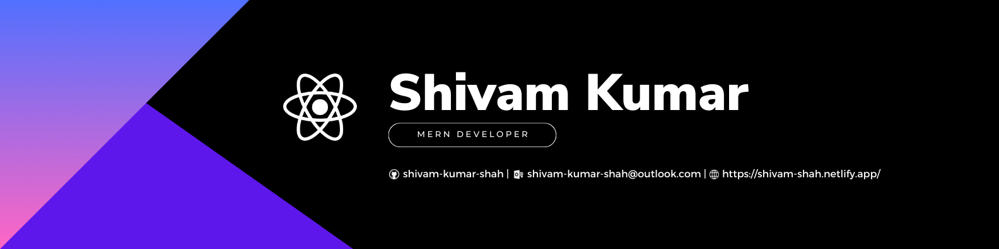

<!-- Introduction -->

<h1 align="center">Howdy!😶‍🌫️ I'm Shivam Kumar</h1>

## About me

- 👀 I’m currently working on **Online-IDE**

- 📖 I’m currently learning **DevOps**

- 🫣 All of my projects are available on [My Portfolio Website](https://storied-madeleine-fcf12f.netlify.app/)

- 💬 Lets discuss **React JS, Express, Flutter**

- 📫 Reach me at [shivam-kumar-shah@outlook.com](mailto:shivam-kumar-shah@outlook.com)

## Connect with me

## Skills

## Stats

